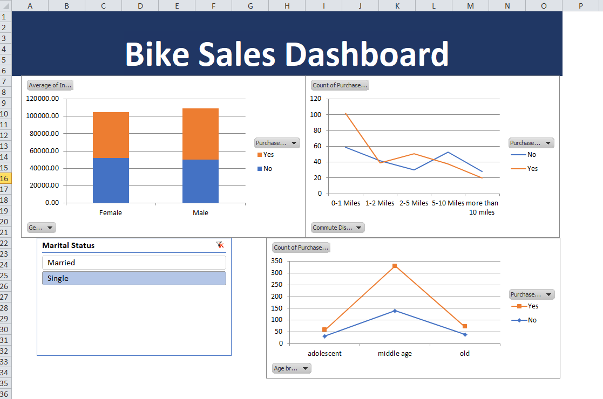

# Excel-Bike-Sales-Dashboard-

## 📊 Project Overview
This project analyzes bike sales data using Microsoft Excel and presents insights through an interactive dashboard.

## 🔧 Tools Used
- Microsoft Excel
- Pivot Tables
- Charts & Visualizations

## 📈 Key Insights
- Sales trends based on customer demographics
- Income vs purchase patterns
- Regional sales distribution

## 🖼️ Dashboard Preview

## 📂 Files Included
- Excel Project Dataset.xlsx
- Dashboard fileexcel
